# 任务链执行系统 — 实现时序说明

## 架构概览

```
┌─────────────┐     HTTP/REST      ┌──────────────┐    Prisma    ┌──────────┐
│   前端        │ ←──────────────→  │  后端 Server   │ ←─────────→ │ PostgreSQL│
│ StepGraphPage│                    │ execution.    │              │          │
│ useStepExec  │                    │ controller    │              │ TaskExec │
│ MergeDialog  │                    │ execution.    │              │ Step     │
│ executionApi │                    │ service       │              │ Task     │
└─────────────┘                    └──────┬───────┘              └──────────┘
     │ 轮询 3s                            │ SDK v2
     │                                    ▼
                                     ┌──────────────┐
                                     │ opencode-v2   │
                                     │ (SDK v2 封装) │
                                     └──────┬───────┘
                                            │ HTTP API
                                            ▼
                                     ┌──────────────┐
                                     │ opencode      │
                                     │ Engine        │
                                     │ localhost:4096│
                                     └──────────────┘
```

## 完整时序图

```mermaid
sequenceDiagram
    actor User
    participant FE as StepGraphPage<br/>(前端)
    participant Hook as useStepExecution<br/>(前端 Hook)
    participant API as executionApi<br/>(前端 HTTP)
    participant Ctrl as execution.controller<br/>(后端 Koa)
    participant Svc as execution.service<br/>(后端 Service)
    participant DB as PostgreSQL<br/>(Prisma)
    participant V2 as opencode-v2<br/>(SDK v2 封装)
    participant Engine as opencode Engine<br/>(localhost:4096)

    %% ═══════════════════════════════════════
    %% Phase 1: 页面加载 / 恢复执行
    %% ═══════════════════════════════════════
    Note over User, Engine: Phase 1 — 页面加载 & 恢复执行状态
    User->>FE: 打开 StepGraphPage
    FE->>Hook: useEffect → restoreExecution()
    Hook->>API: executionApi.getLatest(taskId)
    API->>Ctrl: GET /api/tasks/:taskId/executions/latest
    Ctrl->>Svc: getStatus(taskId)
    Svc->>DB: taskExecution.findFirst({orderBy: createdAt DESC})
    DB-->>Svc: latest execution | null

    alt 有 RUNNING/CREATING_WORKTREE 的执行
        Svc-->>Ctrl: execution (RUNNING)
        Ctrl-->>API: 200 { execution }
        API-->>Hook: execution
        Hook->>Hook: setExecuting(true), setExecution(latest)
        Hook->>Hook: startPolling(executionId) ◂ 每3秒轮询
    else 无活跃执行
        Svc-->>Ctrl: null 或已完成
        Hook->>Hook: 仅 setExecution(latest)，不轮询
    end

    %% ═══════════════════════════════════════
    %% Phase 2: 用户启动执行
    %% ═══════════════════════════════════════
    Note over User, Engine: Phase 2 — 用户启动任务链执行
    User->>FE: 点击「执行任务链」按钮
    FE->>Hook: executeChain(filteredSteps)
    Hook->>Hook: setExecuting(true), setExecution(null)
    Hook->>API: executionApi.start(taskId, projectId, maxConcurrency)
    API->>Ctrl: POST /api/tasks/:taskId/executions<br/>{ projectId, maxConcurrency }
    Ctrl->>Svc: start(taskId, projectId, maxConcurrency)
    Svc->>DB: task.findUnique → project.findUnique
    Svc->>DB: taskExecution.findFirst({status: CREATING_WORKTREE|RUNNING})
    Note over Svc: 防止同一任务重复启动
    Svc->>DB: StepService.listByTask → 过滤 PENDING 步骤
    Svc->>DB: taskExecution.create({status: CREATING_WORKTREE, totalSteps})

    Note over Svc: 异步启动，不阻塞 API 响应
    Svc-->>Ctrl: return execution (CREATING_WORKTREE)
    Ctrl-->>API: 201 { execution }
    API-->>Hook: execution
    Hook->>Hook: setExecution(exec), startPolling(exec.id)
    Hook-->>FE: Toast「任务链执行已开始」

    %% ═══════════════════════════════════════
    %% Phase 3: 后端创建 Worktree + Session
    %% ═══════════════════════════════════════
    Note over User, Engine: Phase 3 — 后台创建 Worktree & AI 会话 (异步)
    Note over Svc: worktree 名称加时间戳后缀防碰撞：exec-{task}-{timestamp}
    Svc->>V2: createWorktree(baseUrl, projectPath, worktreeName)
    V2->>Engine: POST /worktree/create { directory, name }
    Engine-->>V2: { name, directory }
    V2-->>Svc: WorktreeInfo
    Svc->>DB: taskExecution.update({status: RUNNING, worktreeName, worktreeDirectory})

    Note over Svc: Session 使用 worktree 目录创建（非主分支路径）<br/>确保 AI 在隔离环境中操作
    Svc->>V2: createSessionInWorkspace(baseUrl, worktree.directory, {title, agent: "build"})
    V2->>Engine: POST /session/create { directory=worktree.dir, title, agent }
    Engine-->>V2: { id, title }
    V2-->>Svc: SessionInfo
    Svc->>DB: taskExecution.update({sessionId})

    %% ═══════════════════════════════════════
    %% Phase 4: 前端轮询 & 后端批量执行
    %% ═══════════════════════════════════════
    Note over User, Engine: Phase 4 — 轮询 & DAG 批量执行 (循环)

    loop 每 3 秒轮询
        Hook->>API: executionApi.getLatest(taskId)
        API->>Ctrl: GET /api/tasks/:taskId/executions/latest
        Ctrl->>Svc: getStatus(taskId)
        Svc->>DB: taskExecution.findFirst()
        DB-->>Svc: latest execution
        Svc-->>Ctrl: { status, completedSteps, totalSteps, worktreeName... }
        Ctrl-->>API: 200
        API-->>Hook: execution
        Hook->>Hook: setExecution(latest), onStepUpdated() → refetch steps
        Hook-->>FE: UI 更新：进度 X/Y, worktree 名称
    end

    Note over Svc: executeSteps() 递归批量执行
    Svc->>DB: StepService.listByTask() → getNextSteps(DAG 过滤)
    Svc->>DB: 切取 toStart = available.slice(0, maxConcurrency)

    loop 对 toStart 中每个 step
        Svc->>DB: Step.update(stepId, {status: IN_PROGRESS})
        Svc->>Svc: buildPrompt(step, deps)
        Svc->>V2: sendPrompt(baseUrl, sessionId, prompt, worktree.directory)
        V2->>Engine: POST /session/promptAsync { sessionID, parts }
        Engine-->>V2: 200 (已入队)
    end

    Note over Svc: 等待 1s 让 agent loop 拾取消息，避免 false idle
    Svc->>V2: waitForSessionIdle(baseUrl, sessionId, worktree.directory)
    V2->>Engine: POST /v2/session/wait { sessionID, directory }
    Note over Engine: AI agent loop 逐个处理入队 prompt...<br/>可能耗时几分钟到几十分钟
    Engine-->>V2: 200 (idle)
    V2-->>Svc: resolve

    Note over Svc: 竞态保护：检查 execution.status === 'RUNNING'<br/>若已被 stop() 改为 STOPPED 则放弃本批
    Svc->>DB: taskExecution.findUnique → 校验 status === RUNNING

    Note over Svc: 逐步骤验证：检查 assistant 消息数量<br/>不足时尾部步骤标记为 BLOCKED
    Svc->>V2: getSessionMessages(baseUrl, sessionId, directory)
    V2->>Engine: GET /session/messages { sessionID }
    Engine-->>V2: messages[]
    V2-->>Svc: 统计 assistant 消息数

    loop 对 toStart 中每个 step
        alt i < assistantCount
            Svc->>DB: Step.update({status: COMPLETED})
        else AI 未响应
            Svc->>DB: Step.update({status: BLOCKED})
        end
    end

    Note over Svc: 只在仍是 RUNNING 时更新进度（防 stop 竞态）
    Svc->>DB: taskExecution.updateMany({status: RUNNING}, {completedSteps})
    Note over Svc: 递归调用 executeSteps() 处理下一批

    %% ═══════════════════════════════════════
    %% Phase 5: 执行完成 → 弹出合并对话框
    %% ═══════════════════════════════════════
    Note over User, Engine: Phase 5 — 执行完成 → 合并对话框
    Note over Svc: 无更多步骤 → taskExecution.update({status: COMPLETED})

    Svc-->>DB: status = COMPLETED
    Hook->>API: 轮询 getLatest
    API-->>Hook: { status: "COMPLETED", completedSteps, totalSteps }
    Hook->>Hook: stopPolling(), setExecuting(false)
    Hook->>Hook: showToast('所有步骤已执行完毕')
    Hook-->>FE: execution.status === 'COMPLETED'
    Note over FE: useEffect 检测 COMPLETED 且 execution.id !== dismissedExecId<br/>同一 execution 只弹一次合并对话框
    FE->>FE: setShowMerge(true)
    FE-->>User: 弹出 MergeDialog 合并对话框

    %% ═══════════════════════════════════════
    %% Phase 6: 用户确认合并
    %% ═══════════════════════════════════════
    Note over User, Engine: Phase 6 — 用户确认合并
    User->>FE: 输入目标分支 (如 main) → 点击「合并」
    FE->>Hook: handleMerge("main")
    Hook->>Hook: dismissedExecId.current = execution.id
    Hook->>API: executionApi.merge(executionId, "main")
    API->>Ctrl: POST /api/executions/:executionId/merge<br/>{ targetBranch: "main" }
    Ctrl->>Svc: merge(executionId, "main")
    Svc->>DB: taskExecution.update({status: MERGED, targetBranch: "main"})
    Svc-->>Ctrl: execution (MERGED)
    Ctrl-->>API: 200
    API-->>Hook: execution (MERGED)
    Hook->>Hook: setExecution(updated), setShowMerge(false)
    Hook-->>FE: Toast「已合并到 main」

    %% ═══════════════════════════════════════
    %% Alt: 用户中止执行
    %% ═══════════════════════════════════════
    Note over User, Engine: Alt — 用户中止执行
    User->>FE: 点击「停止执行」
    FE->>Hook: cancelExecution()
    Hook->>API: executionApi.stop(executionId)
    API->>Ctrl: POST /api/executions/:executionId/stop
    Ctrl->>Svc: stop(executionId)
    Note over Svc: 使用 worktree 目录 abort（session 绑定在 worktree 中）
    Svc->>V2: abortSession(baseUrl, sessionId, worktreeDirectory)
    V2->>Engine: POST /session/abort { sessionID, directory }
    Svc->>DB: taskExecution.update({status: STOPPED})
    Svc->>DB: IN_PROGRESS 步骤重置为 PENDING
    Note over Svc: executeSteps 检测到 STOPPED 后放弃本批<br/>不会覆盖已重置的 PENDING 状态
    Svc-->>Ctrl: execution (STOPPED)
    Ctrl-->>API: 200
    API-->>Hook: execution
    Hook->>Hook: stopPolling(), setExecuting(false)
    Hook-->>FE: Toast「正在停止执行...」
```



## 状态流转

```
                          ┌──────────────────┐
                           │                  │
                           │  CREATING_WORKTREE│
                           │                  │
                           └────────┬─────────┘
                                    │
                      worktree + session 创建成功
                      (session 使用 worktree 目录)
                                    │
                           ┌────────▼─────────┐
                           │                  │
                      ┌───►│     RUNNING      │◄──┐
                      │    │                  │   │
                      │    └────────┬─────────┘   │
                      │             │              │
                      │  所有步骤完成│    用户点击停止 │
                      │  (逐步骤验证 │              │
                      │   AI 响应)  │              │
                      │             │              │
                      │    ┌────────▼─────────┐   │
                      │    │                  │   │
                      │    │    COMPLETED     │   │
                      │    │                  │   │
                      │    └────────┬─────────┘   │
                      │             │              │
                      │  用户确认合并│              │
                      │  (同一 execution 只弹一次)  │
                      │             │              │
                      │    ┌────────▼─────────┐   │
                      │    │                  │   │
                      │    │     MERGED       │   │  用户点击停止
                      │    │                  │   │        │
                      │    └──────────────────┘   │        │
                      │                           │        ▼
                      │                  ┌──────────────────┐
                      │                  │                  │
                      │                  │     STOPPED      │
                      │                  │                  │
                      │                  └──────────────────┘
                      │                           │
                      │  IN_PROGRESS 步骤          │
                      │  重置为 PENDING            │
                      │                           │
                      └─────────用户重新执行────────┘

    任何阶段出现不可恢复错误：
    ┌──────────────────┐
    │                  │
    │     FAILED       │
    │                  │
    └──────────────────┘

    AI 未响应的个别步骤：
    ┌──────────────────┐
    │                  │
    │     BLOCKED      │  (非执行状态，是步骤级别状态)
    │                  │
    └──────────────────┘
```

## 关键设计决策

| 决策 | 原因 |
|------|------|
| **异步启动，不阻塞 API** | worktree + session 创建耗时不定，前端通过轮询获取进度 |
| **轮询而非 SSE** | 执行是长时间后台任务（分钟级），3s 轮询开销极小，避免 SSE 断线重连复杂度 |
| **批量模式 executeSteps** | 所有步骤共享一个 AI 会话，`v2.session.wait` 是全局等待。多个并发 wait 会同时 resolve 导致竞态，批量模式确保每批只一次 wait |
| **page restore** | 用户可能刷新页面，`restoreExecution()` 恢复轮询确保前后端状态同步 |
| **promptAsync + waitForSessionIdle** | `promptAsync` 入队不阻塞，`waitForSessionIdle` 阻塞到 AI 处理完毕，替代之前的 setTimeout 随机模拟 |
| **STOPPED 时重置 IN_PROGRESS → PENDING** | 允许用户重新执行被中止的步骤 |
| **Session 绑定 worktree 目录** | AI 在 worktree 隔离环境中操作，不影响主分支代码。worktree 目录同时用于 sendPrompt、waitForSessionIdle、abortSession |
| **逐步骤 AI 响应验证** | 批量完成后检查 session messages 中 assistant 数量，不足时将尾部步骤标记 BLOCKED 而非 COMPLETED，防止虚假完成 |
| **stop/executeSteps 竞态保护** | 标记步骤前检查 `status === 'RUNNING'`（非仅 `!== STOPPED`），进度更新使用 `updateMany` 限定 RUNNING 条件 |
| **MergeDialog dismissedExecId** | 记录已弹过合并对话框的 execution ID，轮询返回同一 COMPLETED 执行时不再重复弹出 |
| **worktree 名称加时间戳** | `exec-{task}-{timestamp}` 防止同一任务重复执行时 worktree 名称碰撞 |
| **waitForSessionIdle 前延迟 1s** | `promptAsync` 入队后 agent loop 需要时间拾取消息，1s 延迟防止 session 本身 idle 导致 wait 立即返回 |

## 已修复的问题

| 问题 | 严重度 | 修复方案 |
|------|--------|---------|
| Session 使用主分支路径创建，worktree 隔离无效 | P0 | 改用 `worktree.directory` 创建 session |
| 批量内所有步骤无差别标记 COMPLETED | P0 | 检查 session messages 中 assistant 数量，尾部未响应步骤标 BLOCKED |
| TaskExecution 缺少外键，删除 Task/Project 不清理 | P1 | 加 `@relation` + `onDelete: Cascade` |
| stop() 和 executeSteps() 并发竞态 | P1 | 状态检查改为 `=== RUNNING`，进度更新用 `updateMany` |
| MergeDialog 关闭后轮询会重复弹出 | P1 | 加 `dismissedExecId` ref 跟踪 |
| worktree 名称碰撞 | P2 | 加 `Date.now()` 后缀 |
| waitForSessionIdle false idle | P2 | 发送后等 1s 再调用 wait |
| 未使用的 StepStatus import | P3 | 删除 |

## 文件清单

| 文件 | 职责 |
|------|------|
| `packages/server/prisma/schema.prisma` | `TaskExecution` 模型（含外键关联 Task/Project）+ `ExecutionStatus` 枚举 |
| `packages/server/src/modules/engine/opencode-v2.ts` | SDK v2 封装：worktree CRUD、session 创建、prompt 发送、waitForSessionIdle、getSessionMessages |
| `packages/server/src/modules/execution/execution.service.ts` | 核心业务逻辑：start → runExecution → executeSteps（递归批量 + 逐步骤验证 + 竞态保护） |
| `packages/server/src/modules/execution/execution.controller.ts` | REST 端点：start / stop / merge / status / list |
| `packages/server/src/modules/execution/execution.routes.ts` | 路由注册 |
| `packages/server/src/router.ts` | 将 execution 路由挂载到主路由 |
| `packages/web/src/types/execution.ts` | 前端类型定义 |
| `packages/web/src/api/execution.ts` | 前端 HTTP API 客户端 |
| `packages/web/src/hooks/useStepExecution.ts` | 前端 hook：executeChain / cancelExecution / mergeExecution / restoreExecution + 轮询 |
| `packages/web/src/pages/StepGraphPage.tsx` | 页面集成：执行按钮 + 进度条 + MergeDialog（dismissedExecId 防重复弹出） |
